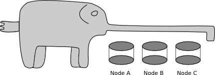

# scalephant - a distributed and highly scalable Key-Value Store based on SSTables

SSTables (String Sorted Tables) are used nowadays in many NoSQL databases like Cassandra or LevelDB. SSTables provide a high throughput for read and write operations. Scalephant is a java implementation of SSTables. I wrote this software for research purposes and to understand some of the techniques that are used in other implementations.

## Changelog

### Version 0.1.1 (Alpha) - 26.08.2016
- Introduced replication strategies
- Handle pending futures in benchmarks correctly and limit the number of pending requests
- Implemented roads in OSM Benchmark
- Improved states for DistributionRegions
- Implemented checkpoints
- Store node states in zookeeper

### Version 0.1.0 (Alpha) - 07.08.2016
- Fixed some crashes in the network handler
- Added first version of the OSM data import benchmark
- Added routing header to network packages 
- First version with working ClusterClient
- Changed client API (Introduced multi result futures)
- Implemented insert request routing
- Changed the structure of the list tables response package
- Spread existing data on region split

### Version 0.0.9 (Alpha) - 14.07.2016
- Added compactification statistics
- Introduced a simple split strategy
- Store the version number of the instances in zookeeper
- Data is now stored in region tables
- Added version number to distribution groups
- Added state field to distribution groups
- Implemented membership connection service

### Version 0.0.8 (Alpha) - 22.06.2016
- Store Distribution Region assignment in zookeeper
- Improved exception handling and prevent half written sstables
- Introduced the multi server client "ScalephantCluster"
- Made GUI settings (ZookeeperHost, Clustername) configurable
- The GUI now uses data fetched from zookeeper instead of mockup data
- The nameprefix of the distribution regions is now stored in zookeeper
- Introduced a simple resource allocation strategy

### Version 0.0.7 (Alpha) - 05.06.2016
- Improved bounding box implementation
- Improved distribution group GUI handling
- Added create and delete distribution group network packages
- Replication factor is now configurable per distribution group
- Added logic to store distribution groups in zookeeper
- Added a in memory structure for distribution groups (updated by zookeeper) 
- Added zookeeper to travis ci environment
- Added zookeeper integration tests

### Version 0.0.6 (Alpha) - 13.05.2016
- Added timestamp queries
- Implemented the table transfer network package
- Changed the requestid of the network protocol to int, to handle more parallel requests
- Removed a lot of buffers in the network implementation (less memory is needed)
- Implemented distributed instance discovery via zookeeper 
- Added a basic GUI
- The zookeeper database can be now deleted with the cluster management script

### Version 0.0.5 (Alpha) - 24.03.2016
- Added basic benchmarks
- Added a logo
- Improved compaction strategy
- Introduced major compactions
- Improved SSTable usage counting
- Added SStable metadata
- Added distributed membership management
- Added a cluster management script
- Integrated zookeeper

### Version 0.0.4 (Alpha) - 03.03.2016
- Added one client example 
- Added configuration file (scalephant.yaml)
- Added support for multiple tuple result queries
- Implemented BoundingBoxes
- Implemented a naming scheme for tables
- Added a start and stop script for Linux (using Apache jsvc)

### Version 0.0.3 (Alpha) - 16.02.2016
- Implemented a network client
- First network protocol specification (see doc/network.md)
- Implemented a server service
- Integrated travis-ci

### Version 0.0.2 (Alpha) - 26.01.2016
- Implemented a SSTable/SSTableIndex examiner for debugging
- Introduced a simple compactification strategy
- Introduced SSTable indices  
- Implemented index binary search, to locate tuples
- Implemented a tuple iterator to perform full table scans
- Handle deleted tuples correctly 
- Implemented SSTable compactification
- Added MultiThreadling support in the SSTableManager
- Switched the reader from File IO to Memory Mapped IO

### Version 0.0.1 (Alpha) - 20.11.2015
- Initial release
