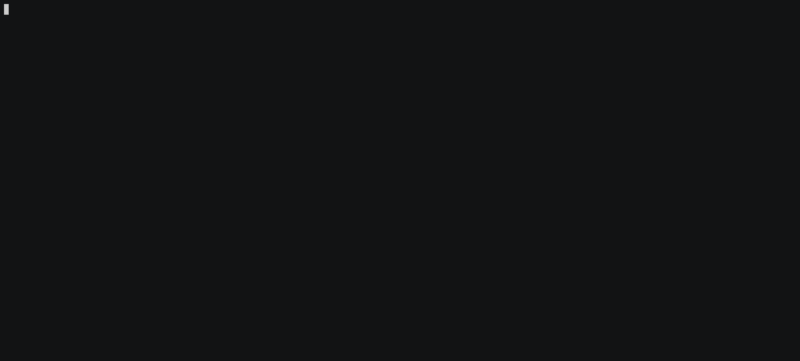
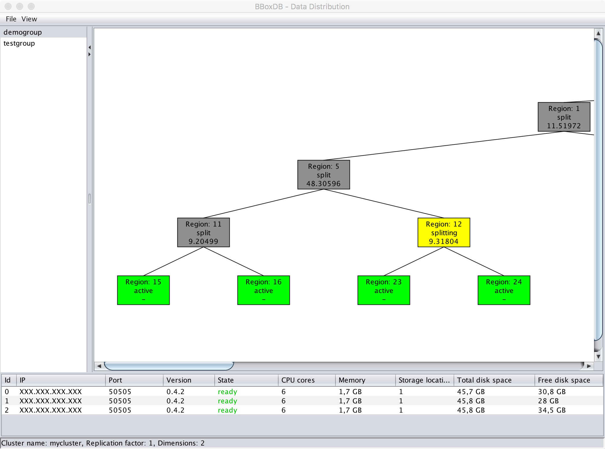

  

     
 

__Please Note:__ The master branch may be in an unstable state during development. Please use our releases for productive environments.

# What is BBoxDB?
BBoxDB is a highly available distributed storage manager, designed to handle multi-dimensional big data.  Primarily, the software is a research project to explore new ways to handle multi-dimensional data in a distributed environment. 

In contrast to existing key-value stores, BBoxDB can handle multi-dimensional efficiently. Existing key-value stores are using one-dimensional keys to address the values. Finding a proper key for multi-dimensional data is hard and often impossible; this is especially true when the data has an extent (e.g., non-point data / regions). To retrieve multi-dimensional data from a key-value store, a full data scan is often required. BBoxDB was developed to avoid the expensive full data scan and to make the work with multi-dimensional data more convenient.

# BBoxDB in Action
In the following screencast, the _command line interface_ of BBoxDB is used to create a 2-dimensional distribution group and two tables. Then some tuples are inserted and operations like key-queries, hyperrectangle-queries, deletes, and joins are executed on the stored data. For accessing BBoxDB from your application, see the [creating client code](https://jnidzwetzki.github.io/bboxdb/doc/client.html) section in the documentation.

 <i>If the font is difficult to read, please click on the image.</i>

## Documentation 
The documentation of the project is located at [https://jnidzwetzki.github.io/bboxdb/](https://jnidzwetzki.github.io/bboxdb/). The documentation also contains the [changelog](http://jnidzwetzki.github.io/bboxdb/dev/changelog.html) of the project.

## Getting started
For a guided tour through the features of BBoxDB, see the [getting started](https://jnidzwetzki.github.io/bboxdb/doc/gettingstarted.html) chapter in the documentation. We also recommend reading the [creating client code section](https://jnidzwetzki.github.io/bboxdb/doc/client.html). The [install guide](https://jnidzwetzki.github.io/bboxdb/doc/installation.html) explains the needed steps to deploy an own BBoxDB cluster. The guide also describes how you can setup a virtualized cluster with 5 BBoxDB nodes in under two minutes, by using [Docker](https://hub.docker.com/r/jnidzwetzki/bboxdb/) and [Docker Compose](https://docs.docker.com/compose/).

## Screenshots
BBoxDB ships with a GUI that allows observing the global index structure. Below you find two screenshots of the GUI. The screenshots show how the space is partitioned. In addition, some details about the discovered nodes are shown. 

  
<i>(The screenshot contains content from <a href="https://www.openstreetmap.org/">OpenSteetMap</a> - CC-BY-SA 2.0)</i>

When 2-dimensional bounding boxes with [WGS 84](https://de.wikipedia.org/wiki/World_Geodetic_System_1984) coordinates are used, a map overlay visualization is supported by the GUI. On the right picture, some spatial data about Germany was imported and the Figure shows, how Germany in partitioned after the data was imported.

## Contact / Stay informed
* Visit our [website](https://bboxdb.org)
* Read our [technical report](https://ub-deposit.fernuni-hagen.de/receive/mir_mods_00001277)
* Join our chat at [gitter](https://gitter.im/bboxdb/Lobby)
* Follow us on Twitter: [@BBoxDB](https://twitter.com/BBoxDB)
* Subscribe our mailing list at [Google Groups](https://groups.google.com/forum/#!forum/bboxdb)
* Visit our [bug tracking system](https://github.com/jnidzwetzki/bboxdb/issues)
* Read the [source code](https://github.com/jnidzwetzki/bboxdb) and the [documentation](https://jnidzwetzki.github.io/bboxdb/)
* For contributing, see our [contributing guide](https://github.com/jnidzwetzki/bboxdb/blob/master/CONTRIBUTING.md)
* If you like the project, please star it on GitHub!

## License
BBoxDB is licensed under the Apache 2.0 license. See the [LICENSE](./LICENSE) file for details.
