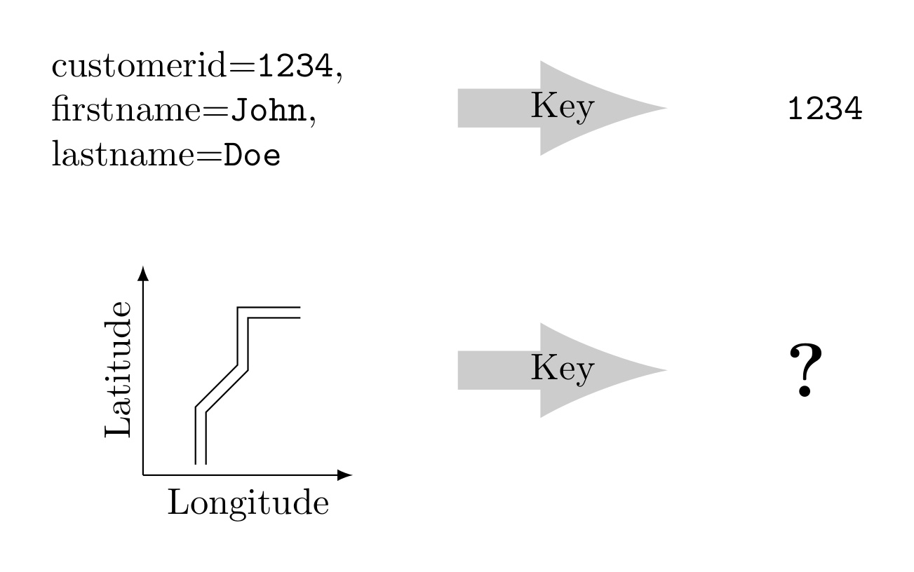

# Documentation

Welcome to the documentation of BBoxDB. BBoxDB is a research project to evaluate a novel storage architecture for multi-dimensional big data. 

In contrast to traditional key-value stores, BBoxDB is optimized to handle multi-dimensional data. Stored data is placed into an n-dimensional space and parts of the space are handled by different nodes. SSTables (string sorted tables) are used as data storage. [Apache Zookeeper](https://zookeeper.apache.org/) is used to coordinate the whole system. The system can be accessed, using a [network protocol](/bboxdb/dev/network.html). Some special features like continuous queries or a history for tuples are also supported.

## Multi-dimensional data in traditional key-value-stores
Existing key-value stores are using one-dimensional keys to address the values. Finding a proper key for multi-dimensional data is hard and often impossible; this is especially true when the data has an extent (e.g., regions). To retrieve multi-dimensional data from a key-value store, a full data scan is often required. BBoxDB was developed to avoid the expensive full data scan and to make the work with multi-dimensional data more convenient.

## What is the difference to traditional key-value-stores?

[NoSQL databases](https://en.wikipedia.org/wiki/NoSQL) and especially [key-value stores](https://en.wikipedia.org/wiki/Key-value_database) are very popular these days. They have a simple data model and can be easily implemented as a distributed system to handle big data. Techniques like _hash-_ or _range-partitioning_ are used to spread the data across a cluster of nodes. Each node stores only a small part of the whole dataset. 

Key-value stores are using the key to retrieve the data. When the key is known, the data can be accessed easily. When the key for a value is not known, a complete scan of the data has to be carried out. Each value has to be loaded and tested if it matches the search criteria. This is a very expensive operation that should be avoided in any case. 

Using the key to locate the data works well with one-dimensional data, but it becomes problematic when multi-dimensional data has to be stored. Its hard to find a proper key for a multi-dimensional value. 

_Example with one-dimensional data:_ Imagine that you have an online shop and you want to store all of your customers in a key-value store. A customer record has attributes like a _customer id_, a _first name_ and a _last name_. To keep the example simple, we assume that the customer records are only accessed using the _customer id_ attribute. Therefore, the records of the customers could be managed efficiently in a key-value store using the _customer id_ attribute as key and the full customer record as value. 

When the customer logs in to your online shop with his customer id, you can simply retrieve the full customer record from the key-value store by knowing the customer id.

_Example with two-dimensional data:_ When you store the geographical information about a road, which key should you choose for the record? You can use the name of the road (e.g., _road 66_). However, this type of key does not help you to retrieve the road by knowing its coordinates. If you have a certain point in space and want to know which roads are located there, you have to perform a full data scan. 

It is almost impossible to find a suitable key that allows locating multi-dimensional data efficiently. Existing techniques like linearization using a [Z-Curve](https://en.wikipedia.org/wiki/Z-order_curve) could encode multiple-dimensions into a one-dimensional key. Point data can be handled, but data with an extent (e.g., a road) is hard to handle. This is the reason why BBoxDB was developed.

BBoxDB extends the simple key-value data model; each value is stored together with a key and a bounding box. This is the reason why BBoxDB is called a _key-bounding-box-value store_. The bounding box describes the location of the data in an n-dimensional space. A space partitioner (a [KD-Tree](https://en.wikipedia.org/wiki/K-d_tree), a [Quad-Tree](https://en.wikipedia.org/wiki/Quadtree) or a [Grid](https://en.wikipedia.org/wiki/Grid_file)) is responsible to partition the whole space into partitions (_distribution regions_) and assign these regions to nodes in the cluster. Depending on the used space partitioner, the regions are split and merged dynamically (_scale up_ and _scale down_), according to the amount of stored data. Point data and data which an extent (regions) of any dimension are supported by BBoxDB.

Hyperrectangle queries (range queries) can be efficiently handled by BBoxDB. This type of query is backed by a two-level index structure. Besides, BBoxDB can store tables with the same dimensions co-partitioned, this means that the data of the same regions in space are stored on the same nodes. Equi- and [spatial-joins](http://wiki.gis.com/wiki/index.php/Spatial_Join) can be processed efficiently locally on co-partitioned data. No data shuffling is needed during query processing.

BBoxDB is implemented as a distributed and highly available system. It supports the _available_ and _partiotion tollerance_ aspects of the [CAP theorem](https://en.wikipedia.org/wiki/CAP_theorem). [SSTables](https://research.google.com/archive/bigtable.html) (string sorted tables) are used as data storage. [Apache Zookeeper](https://zookeeper.apache.org/) is used to coordinate the whole system. Some special features like continuous queries or a history for tuples are also supported.
